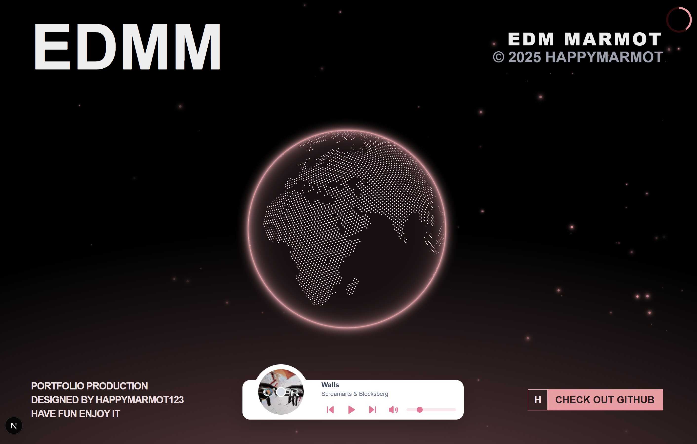
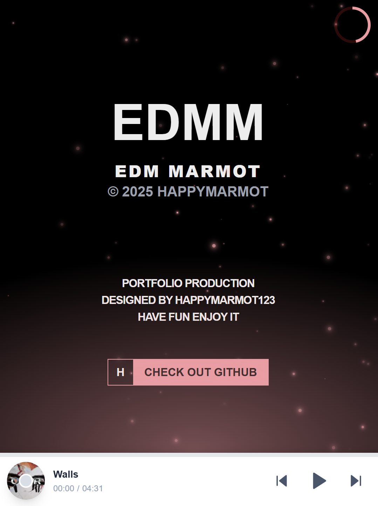

<a href="edmm.vercel.app" alt="Join EDMM" style="display: flex; flex-direction: row;">
 
<!--   -->
</a>

# 🎵 EDMM: Electronic Dance Music Marmot   
### 💡 프로젝트 소개  
EDMM은 Next.js 기반의 인터랙티브 음악 스트리밍 웹 애플리케이션입니다.   
Spotify와 SoundCloud에서 영감을 받아 사이드 프로젝트로 개발하였습니다.   
사용자 친화적인 인터페이스와 실시간 음악 재생 기능을 중심으로 생동감 있는 음악 경험을 제공합니다.  

**아키텍처**: 견고하고 확장 가능한 개발을 위해 **FSD**(Feature-Sliced Design) 아키텍처를 채택했습니다.   
컴포넌트 설계부터 상태 관리, 성능 최적화에 이르기까지 최신 웹 개발 패턴과 기법을 적극적으로 활용했습니다.  

- 진행 기간: 2025년 5월 ~ 2025년 7월
- 참여 인원: 1인 (개인 프로젝트)  
  

## 🛠️ 기술 스택  
### 코어	
- Language: TypeScript
- Framework: Next.js 15
- UI Library: React 19
- Styling: Tailwind CSS
- Animation: Framer Motion

### 백엔드 & 데이터베이스	BaaS: Supabase
- Database: Supabase
- ORM: Drizzle ORM
- Media Management: Cloudinary

### 상태관리 / 테스팅
- Client State: Zustand
- Server State: TanStack Query (React Query)
- Framework: Jest
- Library: React Testing Library

## 🧩 주요 적용 패턴 및 기법
### 1. 컴포넌트 디자인 패턴  
다양한 디자인 패턴을 활용해 컴포넌트의 재사용성과 유지보수성을 높였습니다.  

Presentation & Container 패턴  
Adapter, Compound, Configuration Object 패턴  
HOC(Higher-Order Component) 패턴  
Factory, Facade, Builder, Mediator 패턴  
역할 기반 패턴 등  

### 2. 성능 최적화
서버/클라이언트 컴포넌트 분리: Next.js App Router의 핵심 기능을 활용해 서버 렌더링의 이점을 극대화하고, 클라이언트 측 JavaScript 번들 크기를 최소화했습니다.
이미지 최적화 (next/image): WebP 변환, 리사이징, 지연 로딩을 적용하여 초기 로딩 성능을 향상시켰습니다.
코드 스플리팅: FSD 구조와 Next.js의 라우트 기반 코드 스플리팅을 통해 사용자가 현재 필요한 코드만 다운로드하도록 구현했습니다.

### 3. 백엔드 및 데이터베이스
타입 세이프 ORM (Drizzle ORM): TypeScript와 긴밀하게 통합된 Drizzle ORM을 사용해 컴파일 타임에 오류를 잡을 수 있는 안전한 데이터베이스 스키마와 쿼리를 작성했습니다.
데이터베이스 마이그레이션 (drizzle-kit): 스키마 변경 이력을 체계적으로 관리하여 안전하게 데이터베이스를 업데이트합니다.
