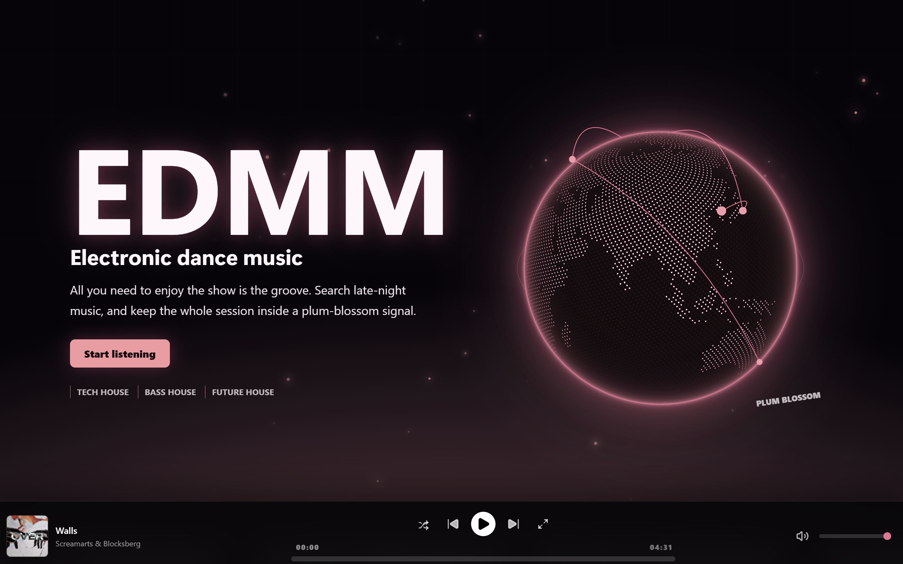
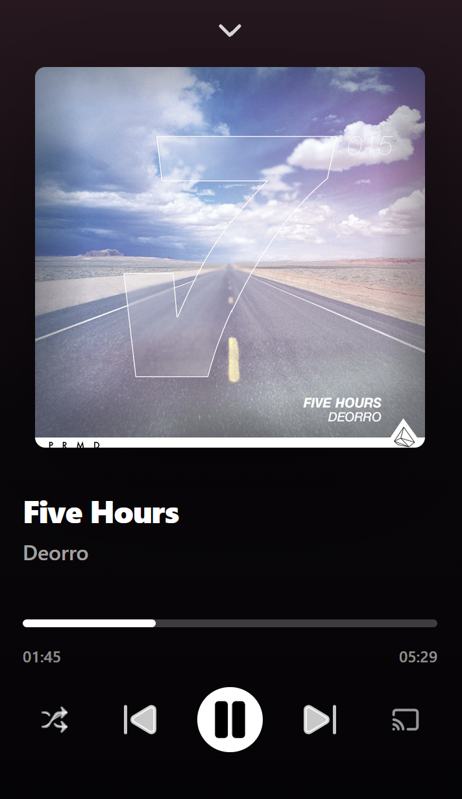
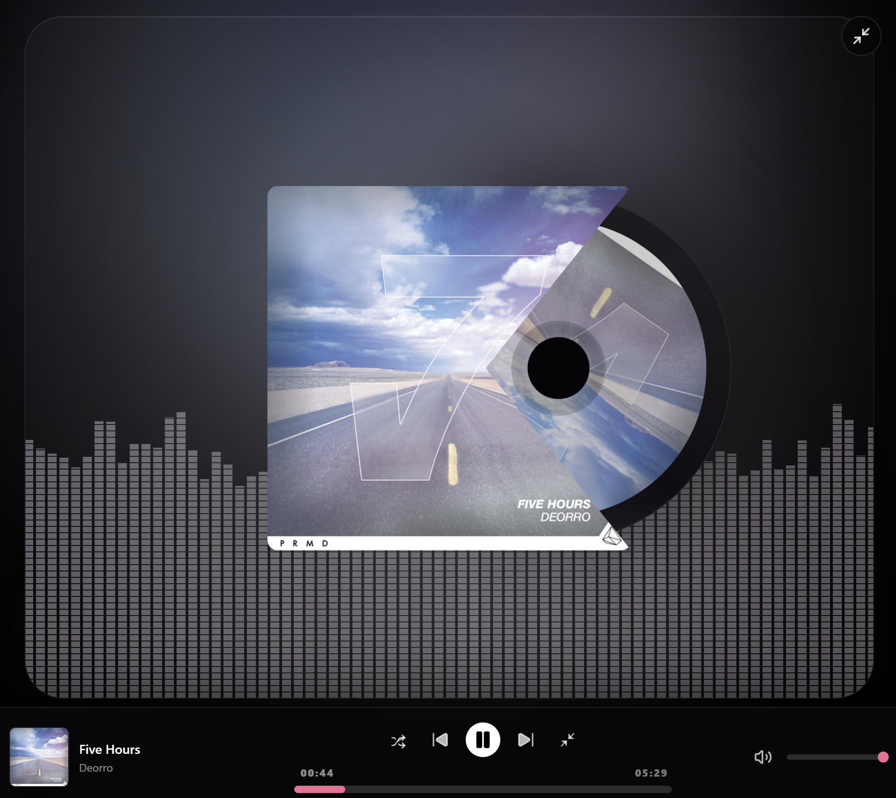
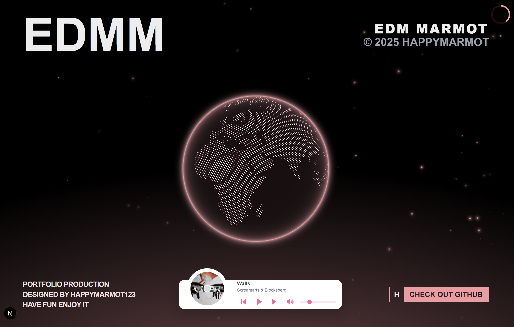
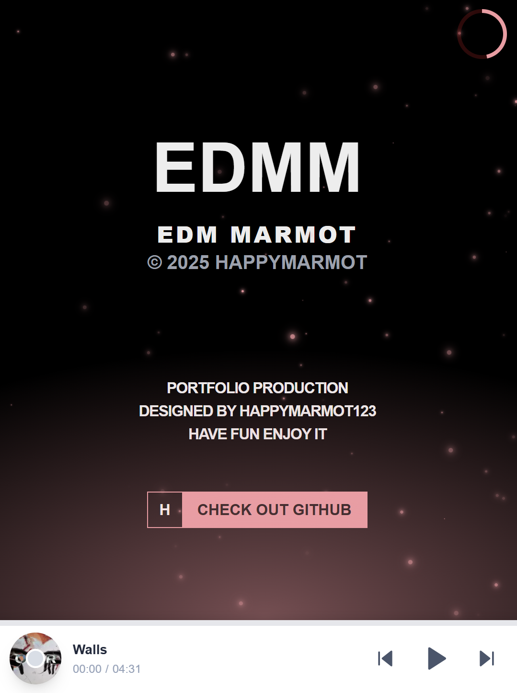



  

<table>
  <tr>
    <td width="50%">
      
    </td>
    <td width="50%">
      
    </td>
  </tr>
</table>

# EDMM V2 Upgrade!

EDMM is a responsive web music player focused on a Spotify-inspired listening experience. V2 replaces a persistent global audio player, deep-linked search, responsive fullscreen playback, and a cleaner music shell architecture.

### What changed in V2

- Added a persistent global player through `AudioPlayerProvider` and `src/widgets/audioPlayer`.
- Added desktop fullscreen mode with album artwork, CD artwork treatment, liquid-glass panel, and album-toned visualizer.
- Improved it with a perfectly responsive design so that it can be used on various devices, including tablets and mobile phones. and reduced layout instability.
- Strengthened the business logic to reduce side effects and robustly improved the functionality.

### Performance and visualizer upgrades

- Improved perceived LCP by simplifying the active music shell surface and keeping media-heavy fullscreen UI out of the initial mobile mini-player layout.
- Improved CLS by reserving stable player/list/detail regions and avoiding layout jumps during initial track seeding and catalog hydration.
- Improved INP by reducing accidental side effects in track selection, queue hydration, and player synchronization.
- Improved frame stability by sharing visualizer rendering logic through a canvas-based visualizer loop.
- Split regular and fullscreen visualizers into separate components while sharing common rendering logic.
- Added album-tone color extraction for the fullscreen visualizer so the visual treatment follows the current artwork.

### Responsive rules

| Viewport | Behavior |
| --- | --- |
| `< 768px` | Mobile player, mobile fullscreen, bottom tabs, no aside, row select plays immediately |
| `768px - 1024px` | Desktop player, collapsible aside, row select only selects |
| `>= 1025px` | Desktop player, always-visible aside, row select only selects |

### Mobile experience

- Mobile fullscreen includes artwork, track metadata, seekable progress, current time, duration, shuffle, previous, play/pause, and next controls.
- Tapping the mini player opens mobile fullscreen playback. fullscreen can be closed by tapping the top arrow or dragging the top close bar downward.

## V1 -> V2 tech stack migration

| Category | V1 | V2 |
| --- | --- | --- |
| Framework | Next.js 15 | Next.js 16.2.9 with App Router and Turbopack build/dev scripts |
| UI runtime | React 19 | React 19.2.7 / React DOM 19.2.7 |
| Language | TypeScript | TypeScript 6.0.3 |
| Styling | Tailwind CSS | Tailwind CSS 4.3.1 with `@tailwindcss/postcss` |
| Server state | TanStack Query | TanStack Query 5.101.1 |
| Client state | Zustand | Zustand 5.0.14 |
| Local database | IndexedDB concept | Dexie 4.4.4 + dexie-react-hooks 4.4.0 |
| Testing | Jest + React Testing Library | Jest 30.0.4, jest-environment-jsdom 30.0.4, React Testing Library 16.3.0, user-event 14.6.1 |

### Added or strengthened in V2

- Added Dexie-based IndexedDB repositories for track cache and recent plays.
- Added react-virtuoso for scalable track list virtualization.
- Added fake-indexeddb for IndexedDB repository tests.
- Added tsx, typescript-eslint, and newer ESLint tooling for the upgraded TypeScript test/build workflow.

### Removed from the V1 direction

- Removed Supabase as the active database/BaaS direction.
- Removed Drizzle ORM and drizzle-kit as active schema/migration dependencies.
- Removed the need for direct detail-page playback flow by normalizing track routes into `/search?track=<id>`.

### Keyboard shortcuts

Keyboard shortcuts are registered once at the global audio widget boundary and are ignored while typing in inputs or interacting with buttons, links, and sliders.

| Key | Action |
| --- | --- |
| `Space` | Play / pause |
| `ArrowLeft` | Seek 10 seconds backward |
| `ArrowRight` | Seek 10 seconds forward |
| `ArrowUp` | Volume up |
| `ArrowDown` | Volume down |

The current architecture document is maintained at: <a href="">[https://github.com/HappyMarmot123/EDMM/issues](https://github.com/HappyMarmot123/EDMM/issues/54)</a>

## V1 Deprecated - Original README

The section below preserves the original V1 README for project history. It describes the first EDMM implementation and may reference architecture, dependencies, APIs, and screenshots that are no longer active in V2. For the current product direction, runtime behavior, and upgraded stack, use the V2 documentation above.

<a href="https://edmm.vercel.app/" alt="Join EDMM" style="display: flex; flex-direction: row;">
 
<!--   -->
</a>

# 🎵 EDMM: Electronic Dance Music Marmot   
### 💡 프로젝트 소개  
EDMM은 Next.js 기반의 인터랙티브 음악 스트리밍 웹 애플리케이션입니다.   
Spotify와 SoundCloud에서 영감을 받아 사이드 프로젝트로 개발하였습니다.   
사용자 친화적인 인터페이스와 실시간 음악 재생 기능을 중심으로 생동감 있는 음악 경험을 제공합니다.  

**아키텍처**: 견고하고 확장 가능한 개발을 위해 **FSD**(Feature-Sliced Design) 아키텍처를 채택했습니다.   
컴포넌트 설계부터 상태 관리, 성능 최적화에 이르기까지 최신 웹 개발 패턴과 기법을 적극적으로 활용했습니다.  

- 진행 기간: 2025년 5월 ~ 2025년 7월
- 참여 인원: 1인 (개인 프로젝트)  
  

## 🛠️ 기술 스택  
### 코어	
- Language: TypeScript
- Framework: Next.js 15
- UI Library: React 19
- Styling: Tailwind CSS
- Animation: Framer Motion

### 백엔드 & 데이터베이스	BaaS: Supabase
- Database: Supabase
- ORM: Drizzle ORM
- Media Management: Cloudinary

### 상태관리 / 테스팅
- Client State: Zustand
- Server State: TanStack Query (React Query)
- Framework: Jest
- Library: React Testing Library

## 🧩 주요 적용 패턴 및 기법
### 1. 컴포넌트 디자인 패턴  
다양한 디자인 패턴을 활용해 컴포넌트의 재사용성과 유지보수성을 높였습니다.  

Presentation & Container 패턴  
Adapter, Compound, Configuration Object 패턴  
HOC(Higher-Order Component) 패턴  
Factory, Facade, Builder, Mediator 패턴  
역할 기반 패턴 등  

### 2. 성능 최적화
서버/클라이언트 컴포넌트 분리: Next.js App Router의 핵심 기능을 활용해 서버 렌더링의 이점을 극대화하고, 클라이언트 측 JavaScript 번들 크기를 최소화했습니다.
이미지 최적화 (next/image): WebP 변환, 리사이징, 지연 로딩을 적용하여 초기 로딩 성능을 향상시켰습니다.
코드 스플리팅: FSD 구조와 Next.js의 라우트 기반 코드 스플리팅을 통해 사용자가 현재 필요한 코드만 다운로드하도록 구현했습니다.

### 3. 백엔드 및 데이터베이스
타입 세이프 ORM (Drizzle ORM): TypeScript와 긴밀하게 통합된 Drizzle ORM을 사용해 컴파일 타임에 오류를 잡을 수 있는 안전한 데이터베이스 스키마와 쿼리를 작성했습니다.
데이터베이스 마이그레이션 (drizzle-kit): 스키마 변경 이력을 체계적으로 관리하여 안전하게 데이터베이스를 업데이트합니다.
