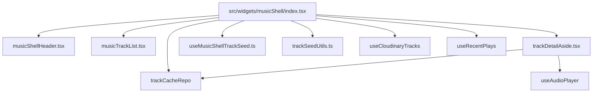
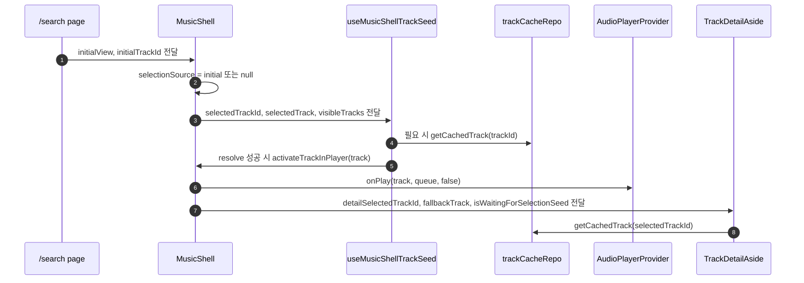
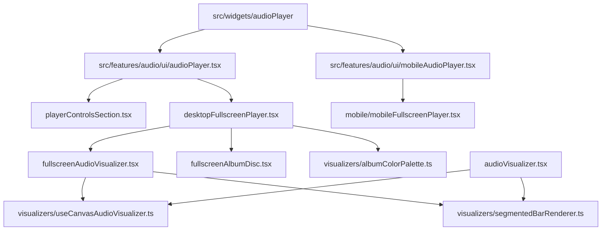

# EDMM 아키텍처 현행 문서

기준일: 2026-06-28

## 1. 런타임 진입점

- `/`는 `src/app/page.tsx`에서 `src/widgets/landing`을 렌더링한다.
- `/search`는 현재 음악 탐색과 플레이어 선택의 주 진입점이다.
- `/search?view=all|recent`만 유효한 검색 뷰로 처리한다. 그 외 값은 `all`로 정규화된다.
- `/search?track=<trackId>`는 특정 트랙을 초기 선택 대상으로 전달한다.
- `/track/[id]`는 트랙 상세 페이지를 직접 렌더링하지 않고, id를 디코딩한 뒤 `/search?track=<id>`로 리다이렉트한다.
- `src/views/library`와 favorites 저장소는 코드에 남아 있지만 현재 `src/app` 아래의 `/library` 라우트에는 연결되어 있지 않다.

## 2. 최상위 구성

```mermaid
flowchart TD
  Root[src/app/layout.tsx] --> Providers[src/app/appProviders.tsx]
  Providers --> Tanstack[TanstackProvider]
  Providers --> AudioProvider[AudioPlayerProvider]
  Providers --> ToggleProvider[ToggleProvider]
  Providers --> PlayerWidget[src/widgets/audioPlayer]

  HomeRoute[src/app/page.tsx] --> Landing[src/widgets/landing]

  SearchRoute[src/app/search/page.tsx] --> SearchClient[src/app/search/searchPageClient.tsx]
  SearchClient --> AudioShell[src/widgets/audioPlayer/audioPlayerShell.tsx]
  AudioShell --> SearchView[src/views/search/index.tsx]
  SearchView --> MusicShell[src/widgets/musicShell/index.tsx]

  TrackRoute[src/app/track/[id]/page.tsx] --> Decode[src/app/track/[id]/trackId.ts]
  Decode --> Redirect[/search?track=id]
```

## 3. Search/MusicShell 구성



- `MusicShellHeader`는 `all`, `recent` 두 뷰만 노출한다.
- `all` 뷰는 `useCloudinaryTracks(query, { resourceType: "all" })` 결과를 사용한다.
- `recent` 뷰는 `useRecentPlays()`에서 id 목록을 받고 `getCachedTracks(ids)`로 표시 가능한 트랙을 복원한다.
- `MusicShell`은 `selectedTrackId`, `selectionSource`, `visibleTracks`, `currentTrackId`를 조합해 리스트 선택과 상세 패널 선택을 동기화한다.
- 768px 미만 모바일에서는 리스트 row select가 즉시 재생까지 수행하고, 768px 이상에서는 row select가 상세 선택만 수행한다.
- 모바일에서는 `TrackDetailAside`를 렌더링하지 않고, `MusicShellHeader`의 `Music views` nav 대신 하단 `bottom-tab-navigation`에서 `All`, `Recent`를 전환한다.
- 768px~1024px 구간에서는 aside를 열고 닫을 수 있고, 1025px 이상 데스크탑에서는 aside를 상시 표시한다.
- `queueForTrack(track)`은 트랙이 현재 visible 목록에 있으면 `visibleTracks` 전체를 큐로 넘기고, 딥링크/캐시 트랙처럼 보이지 않는 트랙이면 단일 트랙 큐를 넘긴다.
- `useMusicShellTrackSeed`는 초기 딥링크 트랙과 최근 재생 트랙의 자동 시드 부수효과를 담당한다.
- `trackSeedUtils`는 선택 트랙, visible match, cache match, first playable fallback 우선순위를 순수 함수로 제공한다.

## 4. 초기 트랙 시드 흐름



현재 `/search?track=...` 첫 진입에서 `visibleTracks`가 아직 비어 있고 캐시도 즉시 준비되지 않은 경우가 있다. 이때 `useMusicShellTrackSeed`는 성급하게 첫 곡 fallback 또는 선택 해제를 하지 않고, visible 데이터가 준비되는 다음 렌더에서 다시 평가한다. `TrackDetailAside`도 이 초기 대기 구간에서는 `Details unavailable` 대신 로딩 상태를 유지한다.

## 5. 플레이어 경계

- `AudioPlayerShell`은 `useAudioPlayer().playTrack`을 `SearchView`에 콜백으로 전달하는 얇은 어댑터다.
- 실제 오디오 부수효과는 `AudioPlayerProvider`가 소유한다.
- `AudioPlayerProvider`는 재생 트랙, 큐, 재생 상태, duration/currentTime, volume/mute, analyser 상태를 관리한다.
- 트랙 재생 시 `trackCacheRepo.cacheTrack`과 `recentPlaysRepo.addRecentPlay`로 캐시와 최근 재생 목록을 갱신한다.
- 오디오 인스턴스와 이벤트 리스너 관리는 `audioInstanceStore`, `audioEventManager`, `audioInstance` 계층에 분리되어 있다.
- `prevTrack`/`nextTrack`은 `playbackQueue`가 있으면 이를 우선 사용하고, 없으면 기본 `queue`를 사용한다. active queue가 2곡 미만이면 이동하지 않는다.
- 초기 seed dedupe fingerprint는 트랙 id, artwork, queue id 목록을 포함한다. 같은 곡이라도 새로고침 후 단일 큐에서 full visible queue로 바뀌면 player queue를 다시 주입한다.

## 6. 플레이어 UI와 비주얼라이저



- `src/widgets/audioPlayer`는 768px 이상에서 데스크탑 `AudioPlayer`, 768px 미만에서 `MobileAudioPlayer`를 렌더링한다.
- 데스크탑 `AudioPlayer`는 하단 플레이어 shell과 데스크탑 fullscreen overlay 상태를 소유한다.
- 데스크탑 fullscreen 버튼은 hydration mismatch를 피하기 위해 클라이언트 mount 이후 `matchMedia("(min-width: 768px)")` 결과가 true일 때만 렌더링한다.
- 데스크탑 fullscreen overlay는 페이지를 덮지만 하단 플레이어는 유지한다. 하단 플레이어의 fullscreen 버튼은 열린 상태에서 다시 누르면 닫는 toggle로 동작한다.
- 데스크탑 fullscreen artwork 영역은 최대 400x400 앨범 이미지와 앨범 기반 CD 요소를 조합한다.
- fullscreen visualizer는 `liquid-glass-panel` 내부에서 동작하며, 일반 visualizer와 같은 segmented bar renderer 및 canvas loop를 공유한다.
- 일반 visualizer는 기존 플레이어 톤을 유지하고, fullscreen visualizer는 `albumColorPalette`가 canvas pixel sampling으로 추출한 앨범 색상을 적용한다.
- 모바일 mini player는 앨범 이미지, 곡 제목/아티스트, play/pause, 읽기 전용 progress bar만 노출한다.
- 모바일 mini player를 누르면 모바일 fullscreen player가 열리고, fullscreen에서는 shuffle, prev, play/pause, next, seek, current/duration time을 제어한다.
- 모바일 fullscreen player는 상단 close bar 클릭 또는 아래 방향 drag-to-dismiss로 닫힌다. 비주얼라이저와 기기 연결 기능은 포함하지 않는다.

## 7. 데이터 계층

- `src/shared/db/edmmDB.ts`가 Dexie 스키마를 정의한다.
- `trackCacheRepo`는 Cloudinary/API에서 얻은 `Track` 메타데이터를 캐시하고 상세 패널/최근 목록 복원에 사용한다.
- `recentPlaysRepo`는 최근 재생 id를 최신순으로 저장하고 중복을 정리하며 최대 10개까지만 유지한다.
- `favoritesRepo`와 `useFavorites`는 `TrackList`, `LibraryView` 등에서 사용 가능하지만 현재 `MusicShell`의 뷰 전환 축에는 포함되지 않는다.

## 8. API와 외부 데이터

- `src/app/api/cloudinary/tracks/route.ts`는 통합 트랙 조회 엔드포인트다.
- `src/app/api/cloudinary/tracks/video/route.ts`와 `image/route.ts`는 리소스 타입별 조회를 담당한다.
- `useCloudinaryTracks`는 React Query로 API 결과를 가져오고, `resourceType: "all"`일 때 비디오 트랙에 이미지 트랙을 artwork fallback으로 병합한다.
- 조회된 트랙은 가능한 경우 `trackCacheRepo.cacheTrack`으로 저장된다.

## 9. 결합도와 변경 위험

| 영역 | 결합도 | 근거 | 주요 영향 |
| --- | ---: | --- | --- |
| `MusicShell` ↔ `AudioPlayerProvider` | 5 | `onPlay`, 큐, 현재 트랙 상태가 핵심 UX를 결정 | 검색, 상세, 하단 플레이어 |
| `AudioPlayerProvider` 내부 오디오 제어 | 5 | DOM Audio/API와 이벤트 상태를 직접 관리 | 재생/일시정지/seek/volume |
| `MusicShell` ↔ `useMusicShellTrackSeed` | 4 | 초기 진입, 최근 재생, 딥링크 선택을 조정 | `/search?track=...`, 최근 재생 복원 |
| `MusicShell` ↔ `trackCacheRepo` | 4 | 최근 목록과 초기 트랙 복구가 캐시에 의존 | Detail 표시, Recent 뷰 |
| desktop fullscreen player ↔ visualizer/color extraction | 3 | fullscreen overlay가 analyser, artwork pixel sampling, shared renderer를 함께 사용 | fullscreen UI, visualizer 색상 |
| mobile player ↔ fullscreen overlay | 3 | mini player와 fullscreen player가 같은 `useAudioPlayer` 상태를 공유 | 모바일 재생 제어, drag close |
| `TrackDetailAside` ↔ `trackCacheRepo/useAudioPlayer` | 3 | 캐시, fallback, 현재 재생 트랙을 조합 | 상세 패널 메타데이터 |
| `trackSeedUtils` | 2 | 순수 함수 중심 | 시드 우선순위 규칙 |
| `trackArtwork` | 2 | artwork fallback 정규화 | 썸네일 일관성 |

## 10. 리팩터링 가드레일

- 오디오 DOM/API 조작은 `AudioPlayerProvider` 밖으로 옮기지 않는다.
- 라우트 컴포넌트는 쿼리 파싱과 초기 prop 전달까지만 담당한다.
- `MusicShell`은 선택/뷰/시드 상태를 오케스트레이션하되 실제 미디어 부수효과를 직접 수행하지 않는다.
- 캐시 조회는 렌더 중 실행하지 않고 hook/effect에서 취소 가드와 함께 처리한다.
- 초기 딥링크 선택(`selectionSource="initial"`)과 사용자의 직접 선택(`selectionSource="visible"`)을 섞지 않는다.
- `visibleTracks`가 비동기로 비어 있는 로딩 구간과 실제 빈 결과를 구분한다.
- fullscreen 버튼처럼 viewport에 의존하는 UI는 서버 렌더에서 조건부 분기하지 않고, 클라이언트 mount 이후 상태로 렌더링 여부를 결정한다.
- visualizer 구현은 `useCanvasAudioVisualizer`와 `drawSegmentedBars`를 공유하고, 일반/풀스크린별 차이는 컴포넌트 props와 palette 계산으로 제한한다.
- 모바일 mini player의 progress bar는 읽기 전용이며, seek는 모바일 fullscreen에서만 허용한다.
- 모바일 전용 UX는 768px 미만으로 제한하고, 768px~1024px 태블릿 구간은 데스크탑 플레이어와 접이식 aside를 사용한다.

## 11. 현재 보완된 초기 진입 이슈

문제 경로:

- `/search?track=<id>`로 처음 진입한다.
- `selectedTrackId`는 먼저 세팅되지만 Cloudinary 목록과 IndexedDB 캐시 조회가 아직 완료되지 않았다.
- 이전 흐름에서는 `visibleTracks=[]`인 순간에 fallback이 먼저 실행되어 선택이 해제되거나 상세 패널이 `Details unavailable`로 전환될 수 있었다.
- 또는 player에는 단일 트랙 큐가 먼저 주입되고, 이후 카탈로그 목록이 로드되어도 같은 곡 seed로 dedupe되어 full queue가 다시 주입되지 않을 수 있었다. 이 경우 하단 플레이어의 prev/next가 active queue 1곡 조건에 걸려 동작하지 않았다.
- 초기 route selection이 있는 상태에서 다른 곡을 재생하면, 이전에는 route selection 보호 로직이 `currentTrackId` 변경을 계속 막아 리스트 선택과 Track Detail 동기화가 늦어질 수 있었다.

현재 대응:

- `useMusicShellTrackSeed`는 `visibleTracks`가 아직 비어 있고 `selectedTrack`도 없으면 초기 fallback을 보류한다.
- 초기 시드 fingerprint에 visible 준비 상태를 포함해, 목록이 준비된 뒤 같은 `selectedTrackId`를 다시 평가한다.
- `MusicShell.activateTrackInPlayer`의 seed fingerprint에는 queue id 목록도 포함한다. 따라서 같은 트랙이라도 단일 큐에서 visible full queue로 바뀌면 `onPlay(track, queue, false)`가 다시 호출된다.
- route initial track은 `initialTrackId`가 바뀔 때만 다시 적용하고, 이후 실제 player `currentTrackId` 변경은 selected/detail 상태에 반영한다.
- `TrackDetailAside`는 `isWaitingForSelectionSeed`가 true인 동안 오류 UI 대신 로딩 UI를 유지한다.
- `MusicShell`은 이 대기 상태를 `selectionSource === "initial" && !selectedTrack && isVisibleLoading`일 때만 전달한다.

## 12. 검증 우선순위

1. `/search?track=<id>` 첫 진입 중 캐시 미스와 카탈로그 로딩이 겹쳐도 Detail이 선택을 잃지 않는지 확인한다.
2. 새로고침 직후 단일 큐 seed 이후 카탈로그가 로드되면 full queue가 다시 주입되어 prev/next가 동작하는지 확인한다.
3. `/search?track=<id>`로 들어온 뒤 다른 곡을 재생하면 리스트 selected와 Track Detail이 현재 재생 곡으로 갱신되는지 확인한다.
4. `/search` 기본 진입에서 첫 visible track이 컨트롤러 대상이 되는지 확인한다.
5. `Recent` 뷰에서 캐시 트랙을 표시하고, `All`로 전환할 때 보이지 않는 선택 상세가 정리되는지 확인한다.
6. 768px 미만 row select는 즉시 재생하고, 768px 이상 row select는 상세 선택만 수행하는지 확인한다.
7. 모바일에서는 aside와 `Music views` header nav가 사라지고, `bottom-tab-navigation`으로 `All`/`Recent` 전환이 가능한지 확인한다.
8. 768px~1024px에서 aside 열기/닫기 버튼이 보이고 실제로 접히는지 확인한다.
9. 데스크탑 fullscreen 버튼은 768px 이상에서만 보이고, 열린 상태에서 같은 버튼으로 닫히는지 확인한다.
10. 모바일 fullscreen은 mini player에서 열리고, 상단 close bar 클릭과 drag-to-dismiss로 닫히는지 확인한다.
11. Recent 기록은 10개까지만 유지되는지 확인한다.
12. `/track/[id]`가 `/search?track=<id>`로 정규화되는지 확인한다.

## 13. 롤백 포인트

- 초기 시드 문제가 생기면 `useMusicShellTrackSeed.ts`의 initial branch부터 확인한다.
- 새로고침 후 prev/next가 멈추면 `MusicShell.activateTrackInPlayer`의 seed fingerprint와 `queueForTrack(track)` 결과를 먼저 확인한다.
- 상세 패널이 오래 로딩되면 `MusicShell`의 `isWaitingForSelectionSeed` 조건과 `isVisibleLoading` 계산을 확인한다.
- Recent 뷰가 비면 `useRecentPlays` 결과와 `getCachedTracks(ids)` 호출 순서를 확인한다.
- 재생 자체가 실패하면 `MusicShell`보다 먼저 `AudioPlayerProvider.playTrack`과 오디오 인스턴스 상태를 확인한다.
- fullscreen 버튼 hydration 문제가 재발하면 `AudioPlayer`의 클라이언트 mount 이후 viewport gating 로직을 확인한다.
- 모바일 player가 보이지 않으면 `src/widgets/audioPlayer`의 `md` breakpoint 분기와 `MobileAudioPlayer` mount 여부를 확인한다.
- 모바일 fullscreen drag 닫기가 오작동하면 `mobileFullscreenPlayer.tsx`의 pointer capture, drag threshold, click guard를 확인한다.
