# EDMM 아키텍처 현행 문서

기준일: 2026-07-02

## 1) 개요

EDMM은 **Next.js 16 App Router 웹 앱**을 중심으로 동작하며, 음원 재생을 위한 상태 중심 아키텍처와 Cloudinary 데이터 계층을 결합한 서비스입니다. 본 문서는 `web` 런타임 기준의 최신 구조를 기준으로 작성됩니다.

- 런타임 핵심: Next.js App Router + React 19
- 도메인 경계: FSD(Feature-Sliced Design) 구조
- 상태/캐시: TanStack Query + Dexie + Provider 중심 재생 상태
- 오디오 코어: `shared/providers/audioPlayerProvider.tsx` 기반 Provider 단일 소유
- 오디오 엔진: `shared/lib/audioInstance.ts` 중심의 dual-slot 전환, EQ 필터 체인, analyser 그래프
- 외부 데이터: Cloudinary API Route 계층
- UI 정책: desktop/mobile player 분기, 모바일 `recent` 뷰 제거, 공용 Radix tooltip surface 사용

---

## 2) 루트 진입점과 실행 흐름

### 2.1 라우트 진입점

- `/` → `src/app/page.tsx` → 랜딩 화면 렌더
- `/search` → 검색/목록/재생 오케스트레이션 핵심 진입점
- `/search?view=all|recent`
  - `all`: 전체 트랙 목록
  - `recent`: 데스크톱에서만 최근 재생 기반 목록
  - 그 외 값은 `all`로 정규화
  - 모바일(768px 미만)에서는 `recent` 딥링크 포함 모든 뷰가 `all`로 고정
- `/search?track=<trackId>`: 초기 시드 트랙 ID 전달
- `/track/[id]` → `src/app/track/[id]/trackId.ts` 디코딩 후 `/search?track=<id>`로 리다이렉트
- `/api/cloudinary/tracks*`: Cloudinary 조회 API(서버 라우트)
- API 레이어 바깥에 별도 모바일 라우트는 없음

### 2.2 부팅/레이어 초기화

- `layout.tsx`가 Provider 레이어(`appProviders`)와 앱 셸을 구성
- 루트 레이아웃은 `viewport`에서 `colorScheme: "dark"`와 `themeColor`를 선언해 삼성 인터넷 등 브라우저 강제 다크 모드 색 변환을 피함
- 오디오 캐싱용 service worker(`/sw.js`)는 루트 레이아웃에서 등록
- `appProviders.tsx`가 전역 의존성을 조립:
  - `TanStackProvider`
  - `AudioPlayerProvider`
  - `ToggleProvider`
  - `widgets/audioPlayer`
- 앱 진입 시 라우트 단위 컴포넌트만 렌더하고, 오디오와 재생 상태는 Provider가 계속 소유

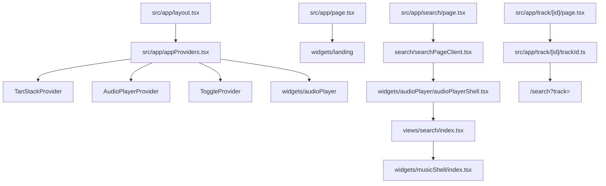

---

## 3) 기능 경계와 책임

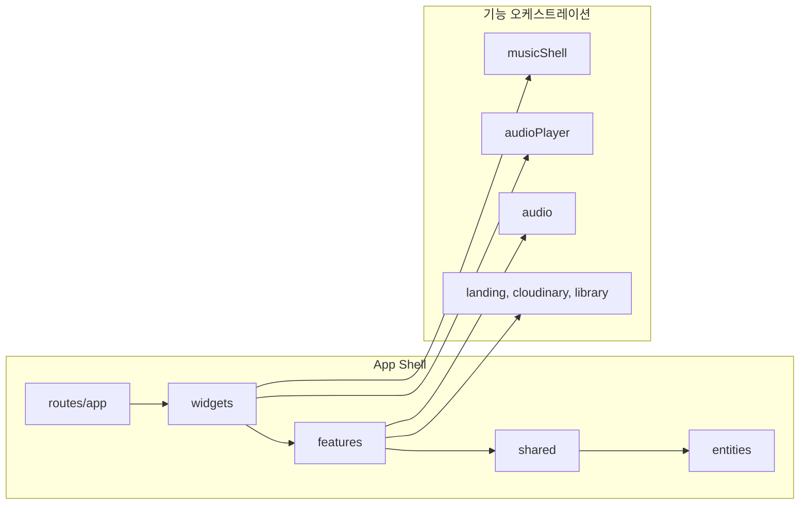

### 3.1 `src/app`

- 라우팅, 로딩/에러/404 처리, API Route, 페이지 쿼리 해석 책임
- `search/page.tsx`는 핵심 화면으로 진입하면서 클라이언트 뷰 조립 책임을 `searchPageClient.tsx`에 위임
- `/track/[id]`는 canonical URL 정책상 상세 라우트에서 검색 흐름으로 정규화

### 3.2 `src/entities`

- 순수 도메인 모델/타입 담당
- `track`, `album`, `artist`, `User`, `ToggleFavorite` 중심 타입 정렬
- 외부 입력 정규화/도메인 변환의 기준점

### 3.3 `src/features`

- 기능 단위 UI/동작 캡슐화
- `features/audio`: 플레이어 UI, visualizer, 키보드 제어, desktop/mobile fullscreen, EQ preset UI
- `features/cloudinary`: 트랙 조회 훅과 어댑터 연동
- `features/landing`: 랜딩 페이지 연출 컴포넌트
- `features/library`: 최근 재생/즐겨찾기/플레이리스트 훅

### 3.4 `src/widgets`

- 화면 조립 단위
- `widgets/musicShell`: 목록/상세/시드의 오케스트레이션(핵심)
- `widgets/audioPlayer`: desktop/mobile 플레이어 전환 및 하단 player shell 조립
- `widgets/trackList`, `widgets/navSidebar`, `widgets/landing`

### 3.5 `src/shared`

- 공통 인프라 레이어
- `shared/api`: Cloudinary Adapter/HTTP client
- `shared/lib`: 오디오 인스턴스, 오디오 이벤트, EQ, 트랙 아티팩트 처리
- `shared/db`: Dexie, repository 계층
- `shared/providers`: 오디오, 토글, 쿼리, hydration, audio helper provider
- `shared/components/myTooltip.tsx`: Radix 기반 공용 tooltip 컴포넌트. EQ preset tooltip과 desktop fullscreen shortcut hint가 같은 surface를 공유

### 3.6 `src/views`

- 화면 단위 조합 뷰: `home`, `search`, `trackDetail`, `library`, `youtubeAltLab`
- `search`가 사실상 메인 운영 플로우

---

## 4) 검색 및 음악 셸(MusicShell) 흐름

1. `search/page.tsx`에서 쿼리 파라미터 파싱
2. `searchPageClient.tsx`가 초기 뷰와 초기 트랙 ID를 계산
3. `AudioPlayerShell`이 `useAudioPlayer().playTrack`을 `SearchView`에 전달
4. `views/search/index.tsx`에서 `MusicShell` 렌더
5. `MusicShell`은 아래 상태를 결합:
   - `selectedTrackId`
   - `selectionSource` (`initial`/`visible`/`none`)
   - `visibleTracks`
   - `currentTrackId`
6. `musicShellHeader`에서 데스크톱 뷰(`all`, `recent`)와 검색어를 제어
7. `musicTrackList`는 결과 목록 렌더와 사용자 선택 이벤트 전달
8. `trackDetailAside`는 선택된 ID 기준의 상세 렌더를 담당
9. 모바일에서는 `TrackDetailAside`와 `Music views` header nav를 렌더링하지 않고, 뷰를 `all`로 고정
10. 모바일 row select는 즉시 재생까지 수행하고, 데스크톱 row select는 상세 선택만 수행

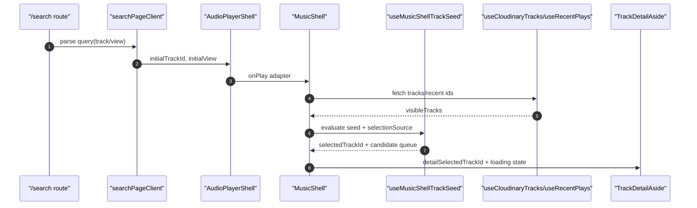

---

## 5) 초기 시드/딥링크 처리

- `/search?track=<id>`에서 진입하면 URL 초기 선택값이 `initialTrackId`로 들어옴
- 초기 `visibleTracks`가 비어 있거나 캐시 조회가 늦는 구간은 2단계로 처리:
  - 후보가 없으면 즉시 강제 fallback를 피하고 대기 상태 유지
  - 데이터 준비 완료 후 동일 TrackID를 다시 평가해 큐 동기화 재반영
- `trackSeedUtils`는 시드 우선순위를 정의:
  - `selectedTrack` 우선
  - visible match 우선
  - cache match
  - first playable fallback
- seed fingerprint는 트랙 id, artwork, queue id 목록을 포함
- 같은 곡이라도 새로고침 직후 단일 큐에서 전체 visible queue로 바뀌면 `onPlay(track, queue, false)`가 다시 호출됨
- route initial track은 `initialTrackId`가 바뀔 때만 다시 적용하고, 이후 실제 player `currentTrackId` 변경은 selected/detail 상태에 반영
- `TrackDetailAside`는 `isWaitingForSelectionSeed`가 true인 동안 오류 UI 대신 로딩 UI를 유지

---

## 6) 오디오 플레이어 경계

- `AudioPlayerShell`은 플레이어 화면 구성의 얇은 어댑터
- 실제 음원 부수효과, 큐 상태 변화, playback lifecycle은 `shared/providers/audioPlayerProvider.tsx`에서 단일 관리
- 핵심 상태:
  - `currentTrack` / `currentTrackId`
  - `queue` / `playbackQueue`
  - `isPlaying`, `duration`, `currentTime`, `volume`, `isMuted`
  - `analyser`, `playbackError`, `audioCapabilities`
- Provider 내부 로직은 훅으로 분리:
  - `useAudioElementSync`: 소스/볼륨 동기화
  - `useMediaSession`: OS 미디어 세션 메타데이터와 컨트롤
  - `useAudioPlaybackLifecycle`: pagehide/visibility 복원
- 재생 액션은 `useAudioPlayer().playTrack(...)` API를 통해 들어오며, Provider 내부에서 상태 동기화 및 사이드이펙트(캐시/이력 반영)를 수행
- `audioInstance.ts`, `audioEventManager.tsx`, `audioInstanceStore`는 Browser Audio API 조작 책임을 분리
- 재생 소스 전환은 `transitionAudioTrack`이 소유하고, sync 훅은 `audio.src`를 직접 할당하지 않음
- `audioInstance.ts`는 dual-slot 오디오 그래프, 크로스페이드, EQ 필터 체인을 포함
- `setVolume(v)`은 `isMuted := (v === 0)`으로 뮤트를 자동 갱신하므로, 소비처에서 `setVolume(v > 0)`와 `toggleMute`를 겹쳐 부르지 않음
- `prevTrack`/`nextTrack`은 `playbackQueue`가 있으면 이를 우선 사용하고, 없으면 기본 `queue`를 사용
- 전역 키보드 단축키(`useAudioKeyboardShortcuts`)는 타이핑 컨텍스트와 slider/range만 차단하고, 버튼은 차단하지 않음

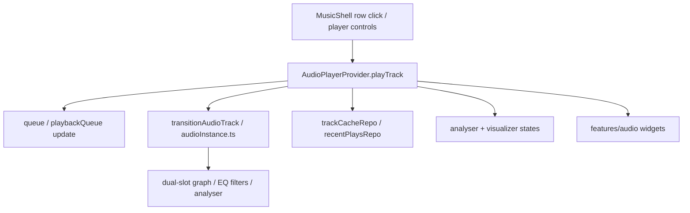

---

## 7) 데이터 계층과 API

### 7.1 API 라우트

- `src/app/api/cloudinary/tracks/route.ts`: 통합 트랙 조회
- `src/app/api/cloudinary/tracks/image/route.ts`: 이미지 리소스 전용 조회
- `src/app/api/cloudinary/tracks/video/route.ts`: 비디오 리소스 전용 조회

### 7.2 어댑터 및 API Client

- `features/cloudinary/hooks/useCloudinaryTracks.ts`가 쿼리 타입(`all`, `video`, `image`)에 따라 결과 결합 및 변환 수행
- `resourceType: "all"`에서는 비디오 트랙에 이미지 트랙을 artwork fallback으로 병합
- `shared/api/cloudinary/cloudinaryClient.ts`에서 Cloudinary 응답 정규화
- `axiosInstance.ts`, `httpClient.ts`에서 요청/응답 인터셉트와 에러 경로 관리
- 조회 결과는 `trackCacheRepo`를 통해 캐시 저장
- Cloudinary 트랙 조회는 Next 데이터 캐시로도 캐싱됨

### 7.3 영구 저장소

- Dexie 스키마: `shared/db/edmmDB.ts`
- repositories:
  - `trackCacheRepo`: 트랙 메타 캐시
  - `recentPlaysRepo`: 최근 재생 ID/타임스탬프 정리, 최대 10개 유지
  - `favoritesRepo`, `playlistsRepo`, `audioSettingsRepo`
  - EQ preset repo: 이퀄라이저 프리셋 영속화
- repository 계층은 Dexie 실패를 도메인 기본값(`undefined`/`[]`/무시)으로 흡수
- service worker(`/sw.js`)가 오디오 재생 캐싱을 담당

---

## 8) 플레이어 UI(Desktop/Mobile)와 반응형 정책

- `widgets/audioPlayer`에서 viewport 기준 분기:
  - `< 768px`: `mobileAudioPlayer` + `MobileFullscreenPlayer`
  - `>= 768px`: `audioPlayer` + desktop fullscreen overlay
- 데스크탑 fullscreen은 `matchMedia("(min-width: 768px)")` 기반으로 클라이언트 마운트 후 노출 (SSR 미스매치 방지)
- 데스크탑 `AudioPlayer`는 하단 플레이어 shell과 desktop fullscreen overlay 상태를 소유
- 컨트롤 버튼 공통 베이스(`PlayerControlButton`/`IconToggleButton`)는 opt-in prop 체계 사용:
  - `hoverSurface`
  - `pressFeedback`
  - `blurOnPointerClick`
- seek bar:
  - 데스크톱 `SeekBar`: hover preview, 시간 tooltip, thumb, pink fill
  - 모바일 `MSeekBar`: 사이즈업 바, 상시 thumb, 드래그 중 시간 라벨 강조
  - 공통 `useSeekDrag`가 pointer capture, release 시 seek 1회 commit, Escape 취소를 담당
- volume bar:
  - 데스크톱 전용 `VolumeBar`
  - 드래그 중 live volume 반영, release 시 영속화
  - wheel/arrow 조작 지원
  - 모바일은 하드웨어 볼륨 관례로 미노출
- desktop fullscreen:
  - `useFadePresence`로 fade in/out 처리
  - `FullscreenBackdrop`, `fullscreenAudioVisualizer`, `albumColorPalette`, `useArtworkCrossfade` 사용
  - 아트워크는 top layer만 렌더해 스냅 아웃 후 280ms fade in
  - backdrop은 450ms crossfade
  - 키보드 단축키 힌트는 수동 `aside`가 아니라 공용 Radix `MyTooltip` controlled 모드로 표시
- mobile mini player:
  - 트랙 제목/아티스트/아트워크
  - play/pause
  - progress(읽기 전용)
  - mini player tap으로 fullscreen open
- mobile fullscreen:
  - prev/play-pause/next
  - 터치 드래그 seek
  - 상단 close bar 클릭 또는 아래 방향 drag-to-dismiss
  - shuffle 버튼은 모바일에서 제거
- `app-viewport-height` 클래스가 모바일 viewport 높이 고정을 담당하며, Tailwind `vh/dvh` 폴백 클래스 페어의 cascade 문제를 피함

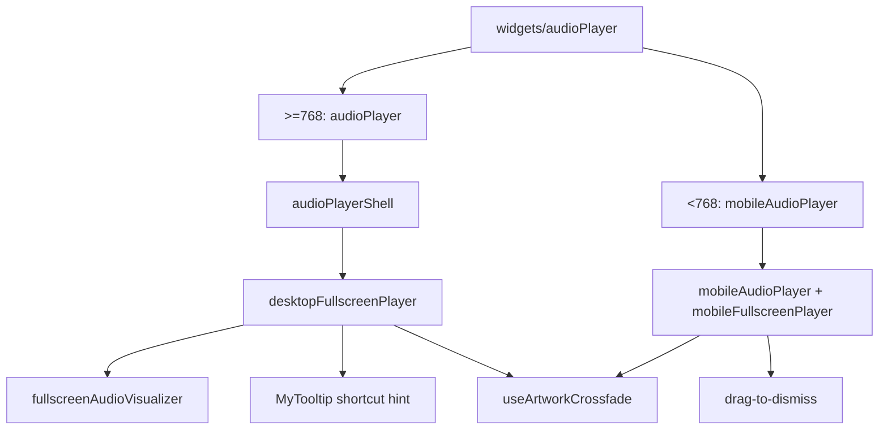

---

## 9) 에러/로딩/회복 정책

### 9.1 라우트 계층

- `loading.tsx`: 라우트별 사용자 체감 완충
- `error.tsx`: 런타임 오류 fallback
- `not-found.tsx`: 라우트 미발견 처리

### 9.2 기능 계층

- 검색/플레이 목록: 상태 기반 렌더 fallback
- 상세 패널: 초기 시드 대기 중에는 `Details unavailable` 대신 로딩 유지
- 오디오: 재생 실패 시 `playbackError` 상태로 바인딩 후 재시도 경로 제공
- 브라우저/저장소: Dexie 실패는 repository 기본값으로 흡수
- tooltip: EQ preset과 fullscreen shortcut hint는 공용 `MyTooltip`으로 표시하고, Radix의 focus/hover/blur/Escape 동작을 활용

### 9.3 기본 재시도 포인트

- 시드 재평가: `selectionSource`, `visibleTracks`, queue fingerprint 변화 감지 시 재적용
- 캐시 재조회: `Dexie` read 미스 시 트랙 미리보기 소스 변경
- 플레이어 동작: UI에서 재생 재시도 시 Provider로 재진입
- 오디오 전환: `transitionAudioTrack`과 audio graph 상태 우선 확인
- fullscreen 전환: `useFadePresence`와 `useArtworkCrossfade` 레이어 상태 우선 확인

---

## 10) 기능 상태 전이 예시 (공통 템플릿)

### 10.1 검색 기능

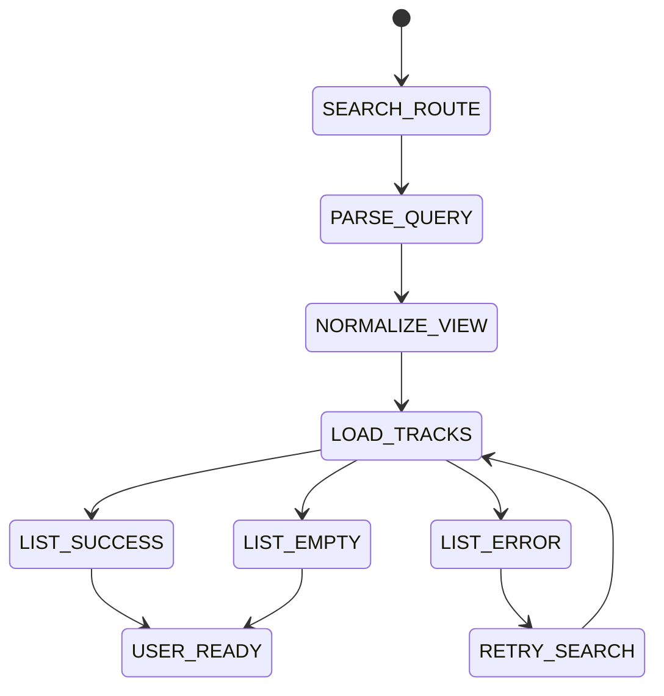

### 10.2 재생 기능

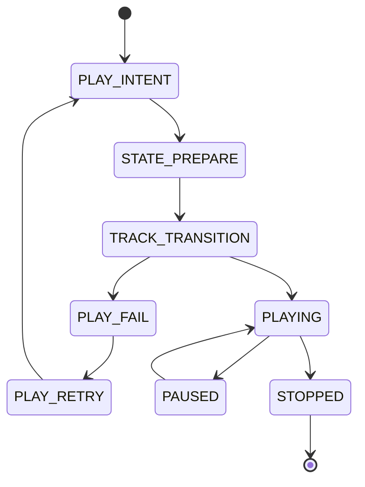

### 10.3 시드/딥링크 기능

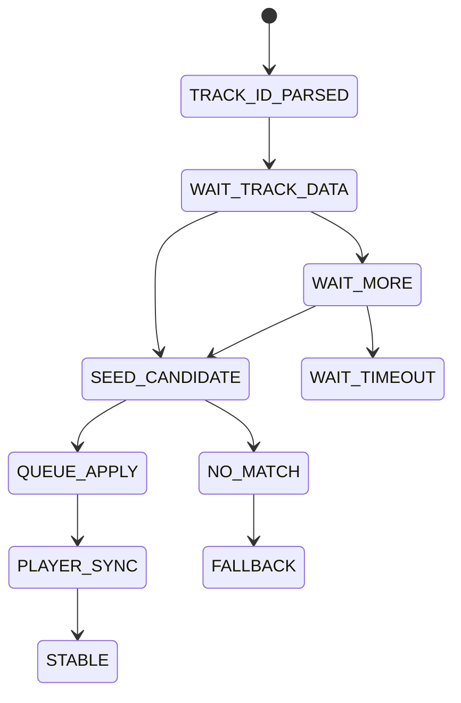

### 10.4 라이브러리/캐시 기능

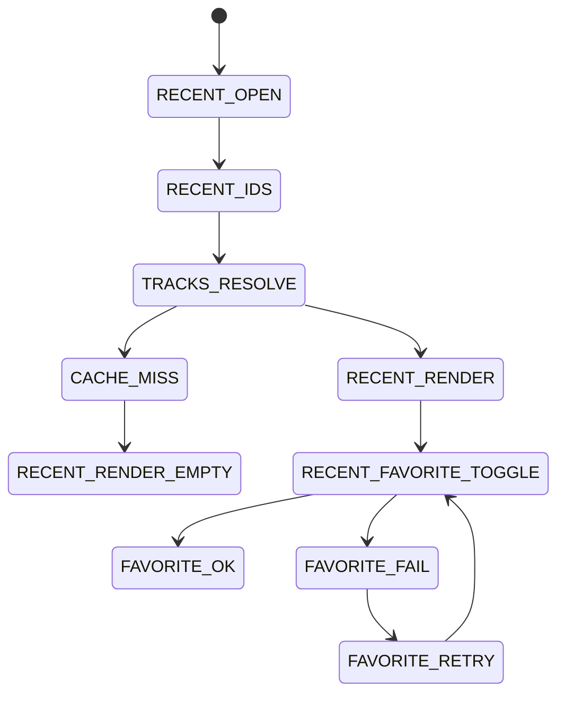

### 10.5 UI(Desktop/Mobile) 기능

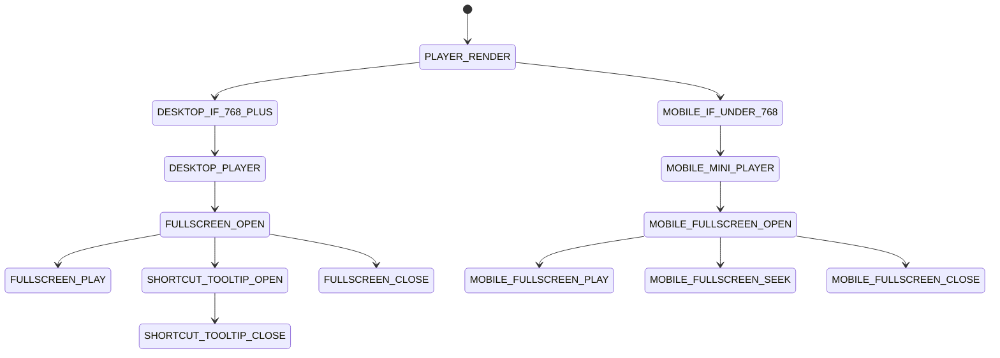

### 10.6 API/저장소 기능

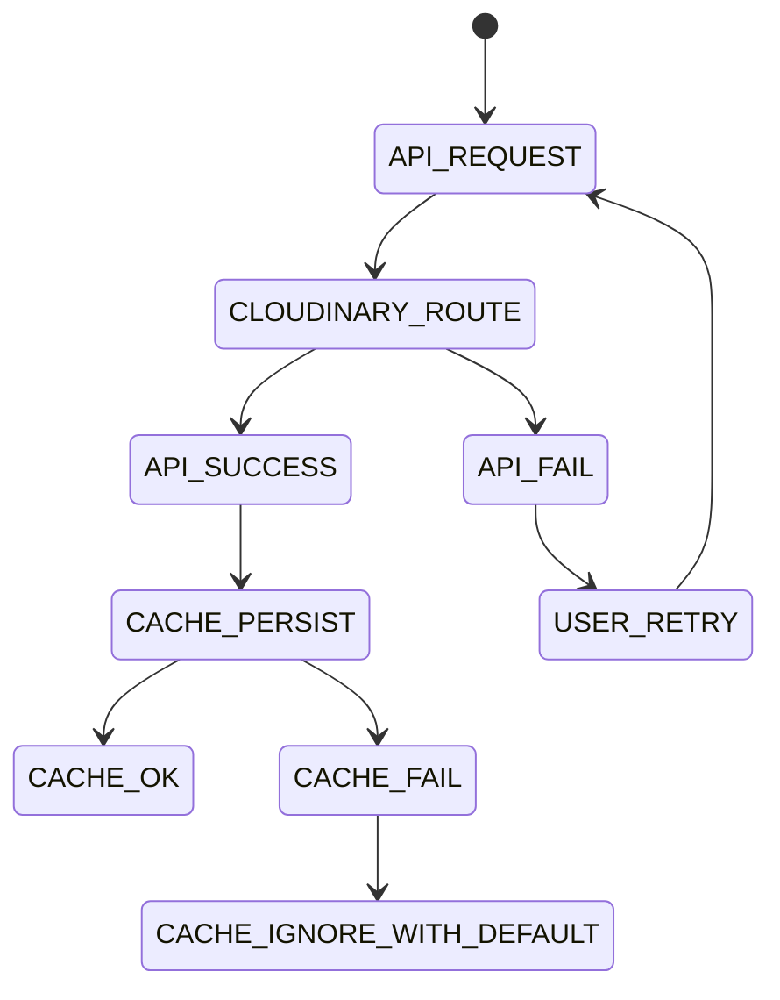

### 10.7 테스트/검증 기능

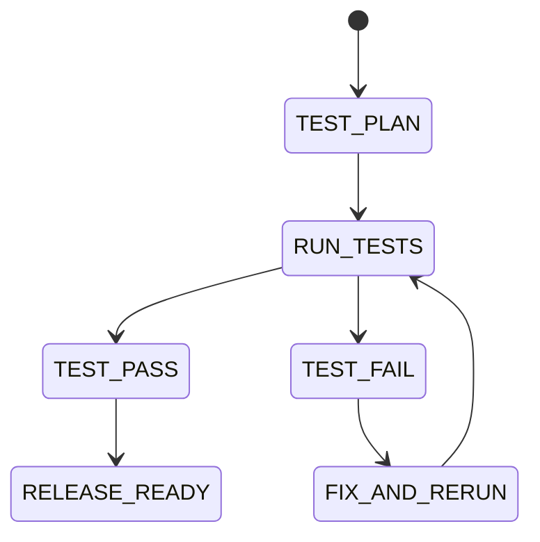
