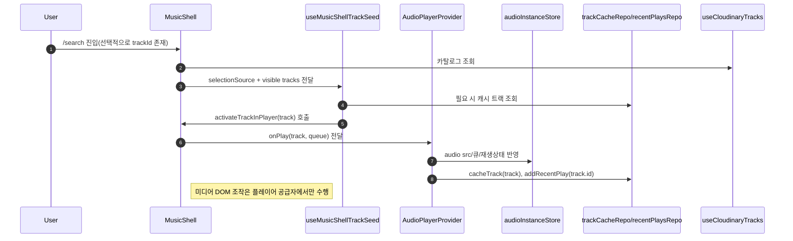

# search 플레이어 아키텍처 (2026-06-27)

## 1) 런타임 범위
- 주요 동작 진입점은 `/search`입니다.
- `/library` 라우트는 제거되었고, 즐겨찾기 화면은 `/search?view=favorites` 쿼리로 접근합니다.
- 플레이어 관련 동작은 `MusicShell`과 `AudioPlayerProvider` 조합이 담당합니다.
- `/track/[id]`로 유입되는 트랙 요청은 내부에서 `/search?track=<id>`로 정규화해 처리하는 현재 설계를 유지합니다.
- 현재 작업 기준으로 초기 결합 지점은 정리되었고, 초기 시드/디테일/재생 동기화는 책임별 분리된 훅/도우미로 관리됩니다.

## 2) 전체 구조(시스템 + 데이터)

```mermaid
flowchart TD
  L[app/layout.tsx] --> P[appProviders.tsx]
  P --> SP[app/search/page.tsx (Server)]
  SP --> SC[app/search/searchPageClient.tsx]
  SC --> PS[audioPlayerShell.tsx]
  PS --> VL[views/search/index.tsx]
  VL --> MS[widgets/musicShell/index.tsx]


  TR[app/track/[id]/page.tsx] -->|decode+route| SRV2[/search?track=id]
  SRV2 --> SP

  MS --> H[musicShellHeader]
  MS --> ML[musicTrackList]
  MS --> AD[trackDetailAside]
  MS --> FV[useFavorites hook]
  MS --> RP[useRecentPlays hook]
  MS --> CQ[useCloudinaryTracks]
  MS --> ST[useMusicShellTrackSeed]

  MS --> APW[audioPlayerShell (onPlay callback)]
  APW --> AP[AudioPlayerProvider]

  AP --> Store[audioInstanceStore]
  AP --> Evt[audioEventManager]
  AP --> Repo[recentPlaysRepo + trackCacheRepo]
```

## 3) 현재 모듈 지도

- 라우트 레이어
  - `app/search/page.tsx`, `app/search/searchPageClient.tsx`
  - `app/track/[id]/page.tsx`

- 기능 레이어
  - `views/search/index.tsx` (검색 화면 구성)
  - `features/cloudinary/hooks/useCloudinaryTracks.ts`
  - `features/library/hooks/useFavorites.ts`
  - `features/library/hooks/useRecentPlays.ts`

- 셸 레이어
  - `widgets/musicShell/index.tsx` (오케스트레이션 + 시드 상태)
  - `widgets/musicShell/useMusicShellTrackSeed.ts` (시드 부팅 부수효과 전담)
  - `widgets/musicShell/trackSeedUtils.ts` (시드 해상도 순수 로직)
  - `widgets/musicShell/trackDetailAside.tsx` (상세 패널 UI 및 조회)

- 플레이어 레이어
  - `shared/providers/audioPlayerProvider.tsx`
  - `app/store/audioInstanceStore.ts`
  - `shared/lib/audioEventManager.ts`
  - `shared/lib/audioInstance.ts`

- 데이터 레이어
  - `shared/db/edmmDB.ts`
  - `shared/db/repositories/{trackCacheRepo,recentPlaysRepo,favoritesRepo}`

- 미디어 유틸
  - `features/audio/components/audioVisualizer.tsx`
  - `shared/lib/util.ts`

- 공통 도우미
  - `shared/lib/trackArtwork.ts`

## 4) 핵심 데이터/상태 흐름



## 5) 결합도 지도(의존 관계)

- 높은 결합도
  - `MusicShell` -> `AudioPlayerProvider` (`onPlay` 콜백)
    - 부수효과: 오디오 인스턴스 및 제어 상태가 플레이어 셸 바깥에 존재
  - `MusicShell` -> `trackCacheRepo`, `recentPlaysRepo`
    - 부수효과: 시드/최근 재생 영속화 경로와 강결합
  - `TrackDetailAside` -> `AudioPlayerProvider`, `trackCacheRepo`
    - 부수효과: 상세 패널이 현재 재생 메타데이터 및 캐시를 직접 참조

- 중간 결합도
  - `MusicShell` -> `useFavorites`, `useRecentPlays`
    - 부수효과: Dexie 라이브 쿼리 변경이 UI 렌더에 직접 반영
  - `MusicShell` -> `useCloudinaryTracks`
    - 부수효과: 비동기 로딩/에러 타이밍이 화면 상태와 연동

- 낮은 결합도
  - `trackDetailAside` 내부 `formatDuration` 유틸은 내부 전용
  - `trackSeedUtils`는 순수 함수 중심
  - `trackArtwork`는 아트워크 정규화 전용

## 6) 부수효과 경계(리팩토링 시 반드시 보존)

- 미디어/재생
  - `audioPlayerProvider.tsx`에서만 실제 오디오 부수효과 수행
    - 오디오 요소 재할당, 재생/일시정지, seek, resume
    - `audioEventManager`를 통한 이벤트 리스너 등록/해제

- 저장소/캐시
  - `trackCacheRepo`: `cacheTrack`, `getCachedTrack`, `getCachedTracks`
  - `recentPlaysRepo`: `addRecentPlay`

- 라우팅/쿼리
  - `/track/[id]` 정규화 라우팅 분기(`decode`) + `/search` 쿼리(view/track) 바인딩

- UI 효과
  - `MusicShell`: 상세 열림 상태, 선택 트랙 id, 시드 소스 제어
  - `TrackDetailAside`: 선택 id 기반으로 캐시 조회 후 렌더

## 7) 현재 위험 지점(사이드이펙트 관점)

- `useMusicShellTrackSeed`가 초기 시드 부팅을 단일 훅에서 수행합니다.
  - 같은 목적의 중복 `useEffect` 분산을 줄여 재현성/중복 트리거를 낮춤
- `trackArtwork`로 아트워크 fallback를 통일했습니다.
  - 상세 패널/플레이어 간 이미지 노출 규칙 충돌 감소
- 리팩터링 시 `selectionSource` 상태(`initial`/`visible`) 전이를 흔들면 초기 시드가 깨질 수 있으므로 주의

## 8) 리팩터링 가드레일(절대 위반 금지)

- 부수효과는 계층별로 단방향 처리
  1) 라우팅/필터 상태
  2) 시드 해상도(순수 함수 + 제어된 비동기 훅)
  3) 재생 호출(`onPlay`)
  4) 미디어 부수효과(플레이어 provider only)

- 미디어 제어 코드를 `MusicShell`이나 라우트 컴포넌트로 이동하지 않음
- 렌더 중 `await` 기반 캐시 조회를 넣지 않음 (`useEffect`/hook + 취소 가드에서만 처리)
- 상세 선택과 즉시 재생을 분리
  - 상세 패널은 어떤 항목이든 선택만 가능해야 하며, 즉시 재생은 명시 액션만 수행

## 9) 다음 리팩터링 우선순위

1. 계약 정비
   - `trackSeedUtils.ts`를 `sync/async` 해상도 함수를 명시적으로 나누고 에러/폴백 규약 문서화
   - `isPlayable` 검증은 한 지점에서만 수행

2. 상태 흐름 단순화
   - `selectionSource`와 `seededTrack` 전이를 작은 상태 머신으로 추출해 prop 체인을 축소

3. 복원력 강화
   - 리스트/상세/플레이어에서 공통으로 쓰는 `getSafeTrack` 유틸 추가
   - fallback 전략을 통합해 일관된 트랙 표현 보장

4. 추적성 확보
   - 시드 동작(초기/최근/직접 선택)을 플래그 기반 로그로 제한 노출
   - 필요 시 디버깅 모드에서만 출력

## 10) 현재 구조의 안전성 근거
- 초기 시드 로직은 중복된 여러 effect가 아닌 단일 훅으로 고정됨
- 아트워크 결정 로직이 통합되어 중복 분기 제거
- 상세 패널과 플레이어가 캐시 우선 전략을 공유해 메타데이터 정합성 향상
- 라우팅 fallback 경로가 명확히 고정되어 예외 경로가 제한됨

## 11) 현재 상태(요약)
- `/search` 첫 진입 시 초기 시드 동작: 활성화
- 리스트 Play 버튼/행 클릭의 기본 재생 흐름: 활성화
- 트랙 상세/플레이어 동기화: 현재 플로우에서 일치하도록 정비
- 과거 hydration mismatch 이슈: 현재 흐름에서 방어 포인트 반영
- build 의존성 문제(dexie 패키지): `package.json` 의존성 정합성 단계에서 추가 정리 필요

## 12) 결합도 정량표(가중치 기반, 1~5)

- 가중치 기준
  - 5: 상태 변경이 다수 경로로 즉시 퍼짐, 실패 영향이 큼
  - 4: 변경 시 특정 상위 기능 영향 큼
  - 3: 단일 기능 경로에 영향
  - 2: 주변 경계에서만 영향
  - 1: 독립도 높음

| 항목 | 결합도 점수 | 근거 | 변경 영향 범위 |
| --- | ---: | --- | --- |
| `MusicShell` ↔ `AudioPlayerProvider` | 5 | `onPlay`, 시드 전이, 큐 전달이 핵심 경로 | 라우팅/플레이어 UX 전체 |
| `audioPlayerProvider.tsx` 내부 미디어 제어 | 5 | 오디오 DOM/API를 직접 조작 | 재생/정지/상태 표시 전체 |
| `MusicShell` ↔ `trackCacheRepo` | 4 | 시드 복구와 캐시 조회 의존 | 초기 시드/재생 실패 시 복구 경로 |
| `MusicShell` ↔ `recentPlaysRepo` | 4 | 최근 재생 큐 시드 및 내비게이션 힌트 | 최근 목록/초기 진입 분기 |
| `MusicShell` ↔ `useFavorites`/`useRecentPlays` | 3 | 리스트 뷰 데이터 주입 | favorites/recent 뷰의 정합성 |
| `TrackDetailAside` ↔ `trackCacheRepo` | 3 | 상세 메타데이터 조회 경로 | 상세 패널 렌더, 썸네일 표시 |
| `trackSeedUtils` ↔ `MusicShell` | 2 | 순수 함수 기반, 데이터 형식 규약 의존 | 초기 시드 규칙만 |
| `trackArtwork` ↔ 플레이어/상세 | 2 | 아트워크 정규화 규약 공유 | 썸네일 표시 일치성 |

## 13) 변경 영향도 매트릭스(권고 순서)

1. **낮은 위험 우선 (2~3점)**  
   - `trackArtwork.ts`, `trackSeedUtils.ts`  
   - 기대 효과: 이미지/시드 규칙 통일, 부수효과 최소

2. **중간 위험 (3~4점)**  
   - `MusicShell`의 시드/선택 분기 정리  
   - `TrackDetailAside` 캐시 조회 경계 강화  
   - 기대 효과: 초기 진입 안정성, 상세-플레이어 동기화 보강

3. **높은 위험 (5점, 기능 블로킹 주의)**  
   - `audioPlayerProvider.tsx`  
   - `MusicShell`↔`AudioPlayerProvider` 인터페이스 정합  
   - 기대 효과: 핵심 플레이어 동작 전체 개선/회귀 최소화

4. **리스크 체크리스트(변경 전/후 필수 확인)**  
   - `/search` 첫 진입 시 첫 곡 세팅
   - 목록 Play 버튼 동작
   - 목록 행 클릭 시 상세 표시 후 재생 전환
   - 썸네일(상세/플레이어) 동기화
   - hydration mismatch 경고 없음
   - 라우팅/쿼리(`/track/[id]`, `/search` view/track) 정상 동작

## 14) 작업별 실패 포인트 / 롤백 포인트

### 14-1) `trackArtwork.ts` 변경

- 실패 포인트
  - 캐시/상세/플레이어에서 사용되는 아트워크 우선순위가 뒤바뀌어 썸네일이 깨짐
  - 빈 문자열(`""`)이 그대로 전달되어 fallback 아이콘만 표시됨
  - `normalizeArtworkUrl` 로직이 과도하게 공백만 정리해 실제 유효 URL도 제거함
- 롤백 포인트
  - `trackArtwork.ts` 변경은 단위로 되돌리기 쉬움
  - 기존 `cachedTrack.artworkUrl || fallback` 방식으로 즉시 복구

### 14-2) `trackSeedUtils.ts` + 시드 규칙 변경

- 실패 포인트
  - 최근 재생/초기 쿼리(`trackId`) 시드 선택 우선순위 역전
  - 최근 재생 id가 없을 때 첫 재생 가능 트랙으로 내려가지 않음
  - 캐시 미스 처리 시 예외가 전파되어 초기 진입에서 아무 곡도 세팅되지 않음
- 롤백 포인트
  - `resolveInitialSeedTrackWithCache` / `resolveRecentSeedTrackWithCache` 로직만 분기 전환 가능
  - 실패 시 `firstPlayableTrack(visibleTracks)` 폴백으로 되돌리면 UI는 즉시 회복

### 14-3) `useMusicShellTrackSeed.ts` 변경

- 실패 포인트
  - `selectionSource` 전환 타이밍이 틀어져 시드가 반복 실행되거나 실행 안 됨
  - 비동기 캐시 조회 race condition으로 잘못된 곡이 시드됨
  - `seededTrackRef` 정합성 깨짐으로 최초 세팅 후 영구적으로 재생이 멈춤
- 롤백 포인트
  - 훅 단위로 `selectionSource` 분기를 이전 동작으로 되돌릴 수 있음
  - `resolvedInitialTrackRef`/`resolvedRecentTrackRef` 가드 제거 후 기존 `MusicShell` 인라인 시드 로직으로 되돌리기

### 14-4) `MusicShell/index.tsx` 변경

- 실패 포인트
    - 현재 재생 상태와 상세 선택 상태가 분리되지 않아 목록 클릭/상세 선택이 서로 덮어쓰기
  - 라우트 파라미터 기반 초기값(`initialTrackId`) 변경 시 뷰 렌더와 플레이어 큐 불일치
  - `visibleTracks` 전환 중 선택 트랙이 누락되어 화면에서는 재생 중인 곡과 다른 상세가 보임
- 롤백 포인트
  - `onPlay` 래퍼(`activateTrackInPlayer`)만 이전 버전으로 되돌리면 대다수 경로 복구
  - `selectionSource`와 `selectedTrackId` 관리만 이전 동작으로 임시 고정 가능
  - 필요 시 리스트 선택만 담당하는 최소 패치로 단계적 롤백

### 14-5) `TrackDetailAside.tsx` 변경

- 실패 포인트
  - 캐시 조회 시 selected id 불일치로 상세가 빈 화면으로 전환
  - 로딩 스테이트 미흡으로 `track` 객체가 undefined 상태에서 렌더 분기 오류
  - 썸네일/재생 버튼이 선택 트랙과 불일치
- 롤백 포인트
  - 캐시 조회 fallback 분기(`cachedTrack?.id === selectedTrackId`)만 이전 방식으로 되돌리면 표시 안정화
  - `selectedTrackId` 기준 렌더 게이트를 보수적으로 처리해 즉시 복구

### 14-6) `audioPlayerProvider.tsx` 변경

- 실패 포인트
  - `audio.src` 동기화 지연으로 재생이 안 되거나 이전 트랙이 계속 재생
  - `playTrack`에서 `TrackInfo` 변환 실패 시 큐/현재곡 상태가 깨짐
  - `cacheTrack`/`addRecentPlay` 에러로 초기 로딩이 멈추는 현상
- 롤백 포인트
  - `trackInfo` 변환 + 큐 구성 부분만 이전 구현으로 되돌리는 게 가장 안전한 단일 복구 경로
  - `audio` 부수효과 블록을 분리하지 못한 경우 바로 이전 커밋 전 상태로 롤백
  - 필요 시 `playTrack` 진입부에서 즉시 리턴 가드와 동기 fallback만 적용

### 14-7) 라우팅/쿼리 변경

- 실패 포인트
  - `/track/[id]` decode 분기에서 `view` 파라미터가 유실됨
  - 쿼리 갱신 타이밍에 따라 첫 시드가 비어 있음
- 롤백 포인트
  - 라우팅 전환은 `app/track/[id]/page.tsx` 각각 개별 파일 단위로 되돌릴 수 있음
  - 쿼리 우선순위 규칙을 임시로 `trackId` > `view` > 기본값으로 고정해 안정 동작 확보

### 14-8) `"/" -> "/search"` 진입 초기화 이슈

- 원인
  - `"/"` 에서 `"/search"` 이동 시 `initialTrackId`가 비어 있으므로, `MusicShell`가 새 세션처럼 `selectionSource`를 `null`로 두고 최근 트랙/첫 곡 시드를 시도할 가능성이 있음.
  - 재생 중이어도 링크가 단순 `/search` 고정 경로라면 `SearchPage`가 현재 트랙을 알 수 없음.

- 대응(현재 적용)
  - 랜딩 Hero/Footer에서 현재 플레이어 `currentTrackId`를 읽어 `/search` 링크에 `track` 쿼리를 붙임.
    - 예: `/search?track=<assetId>`
  - `/track/[id]` 및 `/search` 진입에서 `view`/`track` 쿼리 보존 규칙으로 현재 컨텍스트 복구를 유지.
  - `MusicShell`는 `initialTrackId` 또는 현재 오디오 트랙(`currentTrackId`)를 기반으로 초기 `selectionSource`/`selectedTrackId`를 유지하도록 보정.

- 롤백 포인트
  - 링크 보존 로직만 되돌리면 즉시 기존 동작으로 복귀 가능
  - 필요 시 `MusicShell`의 `selectionSource` 초기화 로직만 이전 버전으로 되돌려 비교 검증

